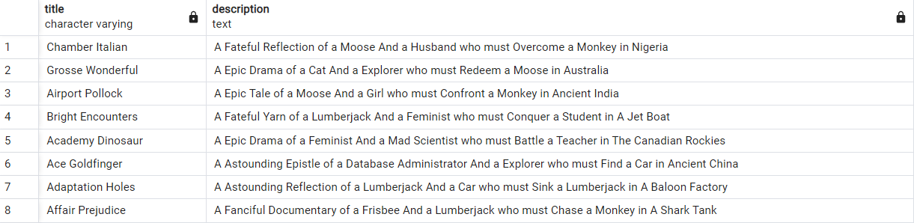
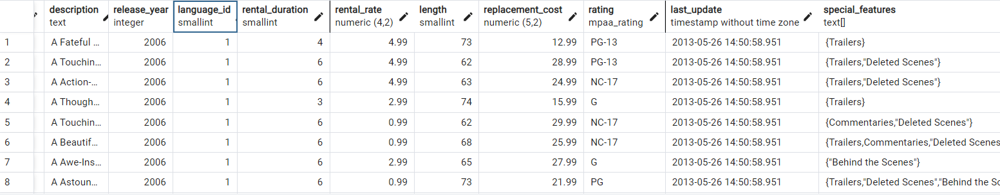
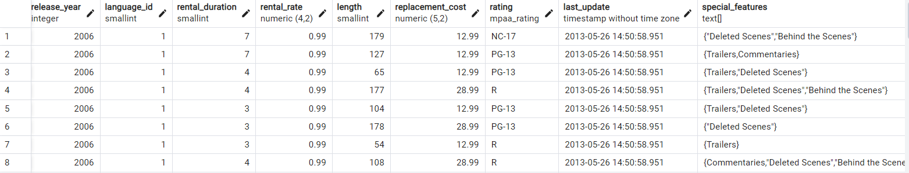
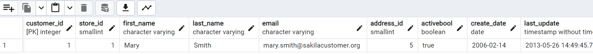
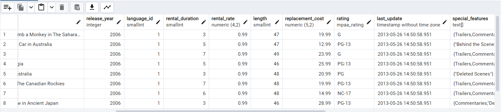

Bu repomuzda Patika.dev platformunda bulunan SQL modülünün ödevinde verilen soruları çözeceğiz. Bu sorular aşağıda sırası ile verilmiştir. Metinde ismi geçen dvdrental örnek veritabanı postgresqltutorial.com sitesinden alınmıştır.


Aşağıdaki sorgu senaryolarını dvdrental örnek veri tabanı üzerinden gerçekleştiriniz.

- film tablosunda bulunan title ve description sütunlarındaki verileri -   sıralayınız.
- film tablosunda bulunan tüm sütunlardaki verileri film uzunluğu (length) 60 dan büyük VE 75 ten küçük olma koşullarıyla sıralayınız.
- film tablosunda bulunan tüm sütunlardaki verileri rental_rate 0.99 VE replacement_cost 12.99 VEYA 28.99 olma koşullarıyla sıralayınız.
- customer tablosunda bulunan first_name sütunundaki değeri 'Mary' olan müşterinin last_name sütunundaki değeri nedir?
- film tablosundaki uzunluğu(length) 50 ten büyük OLMAYIP aynı zamanda rental_rate değeri 2.99 veya 4.99 OLMAYAN verileri sıralayınız.
### 1

```
 SELECT title, description
    FROM film;
```
Bu sorgumuzun sonucunda önümüze gelen tablo:


### 2
```
SELECT *
FROM film
WHERE length > 60 and length < 75;
```
Bu sorgumuzun sonucunda önümüze gelen tablo:


### 3
```
SELECT *
FROM film
WHERE rental_rate = 0.99 and replacement_cost = 12.99 or replacement_cost = 28.99;
```
Bu sorgumuzun sonucunda önümüze gelen tablo:


### 4
```
SELECT *
FROM customer
WHERE first_name = 'Mary';
```
Bu sorgumuzun sonucunda önümüze gelen tablo:


Bu durumda ismi Mary olan müşterimizin soyadı sadece 1 tane sorgu sonucumuz olduğundan dolayı Smith olacaktır.

### 5
```
SELECT *
FROM film
WHERE length < 50 and NOT (rental_rate = 2.99 or rental_rate = 4.99);
```
Bu sorgumuzun sonucunda önümüze gelen tablo:

