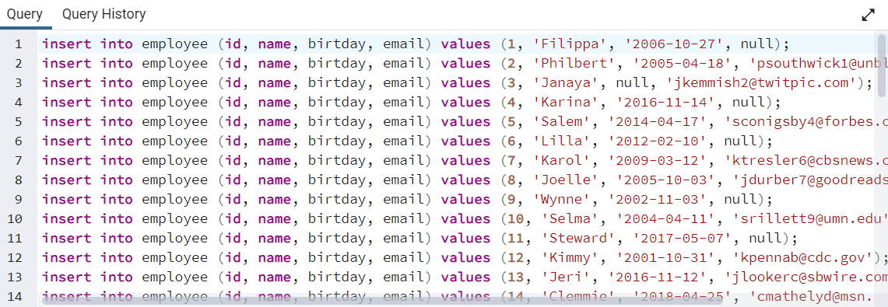
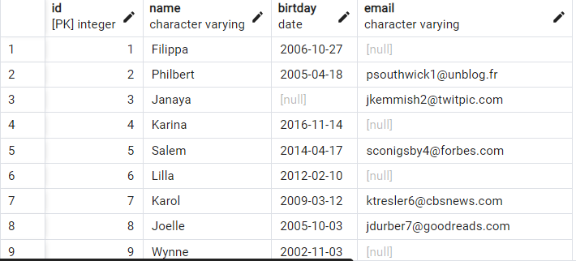

- test veritabanınızda employee isimli sütun bilgileri id(INTEGER), name VARCHAR(50), birthday DATE, email VARCHAR(100) olan bir tablo oluşturalım.
- Oluşturduğumuz employee tablosuna 'Mockaroo' servisini kullanarak 50 adet veri ekleyelim.
- Sütunların her birine göre diğer sütunları güncelleyecek 5 adet UPDATE işlemi yapalım.
- Sütunların her birine göre ilgili satırı silecek 5 adet DELETE işlemi yapalım.


### 1
```
CREATE TABLE employee 
(id integer Primary Key not null,
	name varchar(50) not null,
	birtday DATE,
	email varchar(100))
```


### 2




### 3
```
UPDATE employee
set name = 'Aykan', birtday = '1998-04-05', email = 'aykan@camusoglu.com'
where id = 1;

UPDATE employee
set name = 'Berkay', birtday = '1999-02-17', email = 'berkay@keskin.com'
where id = 2;

UPDATE employee
set name = 'Fatih', birtday = '1999-11-23', email = 'fatih@apaydn.com'
where id = 3;

UPDATE employee
set name = 'Aybük', birtday = '1999-06-01', email = 'aybük@memis.com'
where id = 4;

UPDATE employee
set name = 'Mustafa', birtday = '1998-05-28', email = 'mustafafurkan@gunaydın.com'
where id = 5;
```


### 4
```
DELEte FROM employee where id = 1;
DELEte FROM employee where id = 2;
DELEte FROM employee where id = 3;
DELEte FROM employee where id = 4;
DELEte FROM employee where id = 5;
```
